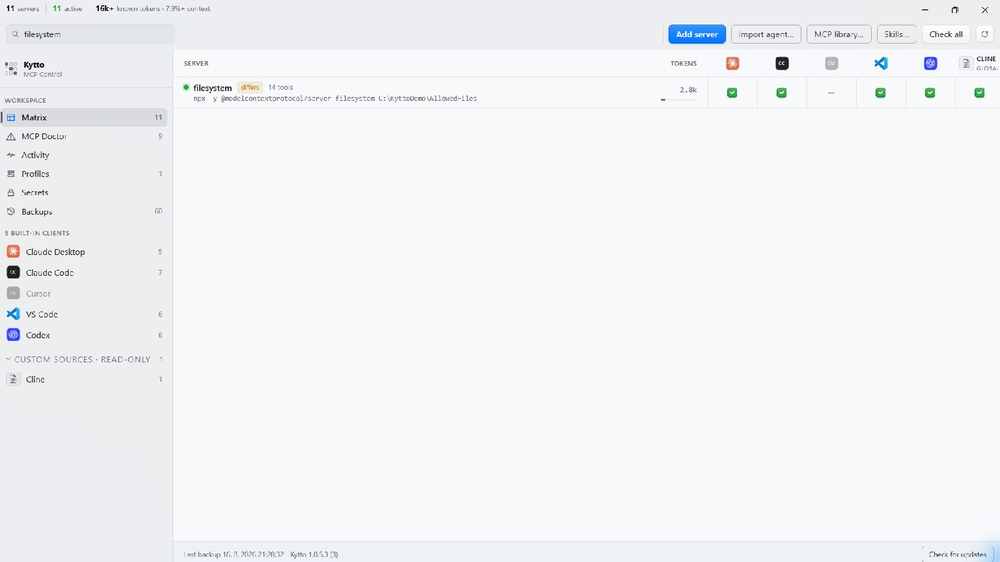

# Kytto MCP for Windows

A local control panel for MCP server configuration: see which server is enabled
in which client, switch it with one click, and see how much context each server's
tools cost.



Kytto reads the MCP configuration of the AI clients installed on your machine and
merges it into one matrix: a row per server, a column per client, a switch per
cell. It is a Windows port of the Kytto macOS app. Free and open source under the
MIT License.

Status: beta. The current release is 1.0.7 ([release notes](docs/releases/)).

## What it does

- **Cross-client matrix.** Enable or disable any server in any supported client
  from one screen. Each client's own "off switch" is used, and the UI says what
  switching off does in that client.
- **Token weight.** A health check starts the server, performs the MCP handshake,
  calls `tools/list` and counts the tokens its tool definitions consume, per
  server and per tool, using the bundled `cl100k_base` vocabulary.
- **Health checks, on request.** Failures show the server's stderr verbatim.
  Servers waiting for an OAuth sign-in are shown as waiting, not failed.
- **Add, edit and delete** a server across several clients at once, from a
  manual form or a small bundled list of starting points. Copies of one server
  that have drifted apart between clients are shown side by side and can be
  unified.
- **Secrets.** Finds sensitive-looking environment values in client configs,
  masks them in the UI, rotates a value in every file that holds it, can keep a
  recoverable copy in Windows Credential Manager, and can restrict a config file
  to your account.
- **Backups and revert.** Every write is preceded by a backup, and backups are
  listed in the app with a one-click revert.
- **Profiles, MCP Doctor and Contract Guard.** Named server sets applied to one
  client with a full preview; actionable findings from config and health
  evidence, including packages started by `npx`/`uvx` without a pinned version,
  which Doctor can pin to the release you just looked up; alerts when a server's
  tool contract changes between checks.
- **Read-only custom sources.** Attach other JSON, JSONC or TOML MCP config files
  to see them in the matrix. Kytto never writes them.
- **Optional local gateway.** Opt-in per server and client: the client launches
  Kytto's `kytto-mcp-proxy` helper, which relays MCP traffic, records
  metadata-only activity (tool names, latency, errors — never arguments or
  results) and can hide individual tools from a client. One click restores the
  original configuration. See [docs/gateway.md](docs/gateway.md).

## What it is not

- **Not a catalog or marketplace.** The value is the cross-client view, not a
  list of servers. The bundled starting points are static; nothing is fetched
  from a registry.
- **Not a cloud service.** No accounts, no sync, no team features.
- **Not a project-config manager.** Kytto manages each client's global
  (user-level) configuration. Claude Code's per-project entries are shown
  read-only; other repository-local configs are not scanned.
- **Not a remote-server checker (yet).** Health checks start local stdio
  servers; HTTP and SSE servers are reported as unsupported.

## Supported clients

Five built-in clients are writable. Each disables a server differently, and that
difference is the substance of the matrix.

| Client | Config file on Windows | Format | How a server is switched off |
|---|---|---|---|
| Claude Desktop | `%APPDATA%\Claude\claude_desktop_config.json` (or the packaged app's equivalent) | JSON | Removed from the file (presence); extension bundles have their own on/off flag |
| Claude Code | `%USERPROFILE%\.claude.json` | JSON | Added to a deny list in a different file, `%USERPROFILE%\.claude\settings.json` |
| Cursor | `%USERPROFILE%\.cursor\mcp.json` | JSON | Removed from the file (presence) |
| VS Code | `%APPDATA%\Code\User\mcp.json` | JSON | Removed from the file (presence) |
| Codex | `%USERPROFILE%\.codex\config.toml` | TOML | `enabled = false` on the server's own table |

"Removed from the file" is only acceptable because Kytto first keeps the exact
bytes of the definition and puts them back byte for byte when the server is
switched on again; the UI says when this happens. Config locations can be
overridden in Settings. Client paths change between client releases; they are
all defined in one file, `src/Kytto.Core/Clients/ClientRegistry.cs`.

## Safety

Breaking someone's configuration is the one mistake a tool like this cannot
make, so every write follows the same rules ([docs/design.md](docs/design.md)
§6):

- **Nothing is written on launch.** Kytto is read-only until you make an
  explicit change. (The only thing launch may do is tighten the permissions on
  Kytto's own data folder.) Health checks run only when you ask.
- **Edits are splices, not rewrites.** Kytto keeps the original text of each
  config and replaces only the byte range it changes. Comments, key order,
  formatting and keys Kytto does not know about are never touched.
- **External changes are respected.** If a file changed on disk since Kytto
  read it, the write is refused rather than merged.
- **Backed up first.** Every write is preceded by a timestamped backup, kept per
  client and revertable from the app. A revert backs up the file it replaces.
- **Atomic writes.** The new content is written to a temporary file in the same
  directory, flushed, and swapped in with `File.Replace`, which also keeps the
  file's existing permissions. The result is re-parsed before it is written.
- **Private copies.** Backups and parked definitions contain whole configs,
  API keys included, so Kytto's data folder (`%APPDATA%\Kytto`) carries an access
  list that grants only your account, `SYSTEM` and Administrators.
- **Secrets stay native.** Secret values are never sent to the web UI unless you
  choose Reveal, and never written to logs.
- **Read-only means read-only.** Custom sources and Claude Code project entries
  are rejected by every write path in native code, not just disabled in the UI.

Clients read their configuration at startup, so a change takes effect after the
client is restarted; Kytto tells you which clients need it.

Before uninstalling, restore Direct configuration for any server you moved to
Gateway mode, because those client entries point at Kytto's helper.

## Network access

Everything Kytto does with your configuration happens locally. The app itself
makes these requests, and only these:

- **Update check.** After the window loads, at most once every 24 hours, a `GET`
  to `https://kytto.jakubhecht.sk/update.php` for the release manifest. No
  configuration, secret or installation id is sent. **Check for updates** makes
  the same request on demand.
- **Update download.** Only when you choose to download an update: the installer
  is fetched from the fixed first-party download URL, checked against the
  manifest's SHA-256 and its Authenticode signature, and run only when you choose
  Install.
- **Package version check.** Only when you click **Check latest** on a server:
  the inferred package name is looked up on `registry.npmjs.org` or `pypi.org`.

Kytto sends no telemetry or analytics.

Links such as an OAuth sign-in page or release notes open in your default
browser only when you click them. A health check runs the server's own command,
and what that command does on the network (for example `npx` downloading a
package) is up to the server.

## Requirements

To run:

- Windows 10 or 11, x64 or ARM64.
- The Microsoft Edge WebView2 Runtime. It ships with Windows 11 and is present
  on most up-to-date Windows 10 installations; otherwise install the Evergreen
  runtime from Microsoft.

Release builds are self-contained, so no separate .NET runtime is needed.

To build from source:

- The .NET 10 SDK (WPF is included; WebView2 comes from NuGet).
- Node.js, for the web-layer tests.
- Python on `PATH` (`python.exe`), for the health-check tests.
- Inno Setup 6, only for building the installer ([docs/release.md](docs/release.md)).

## Build, run, test

```sh
git clone https://github.com/heyitsjakub/KyttoMCP.git
cd KyttoMCP/windows
dotnet build                                   # solution: KyttoMCP.slnx
dotnet test
cd web && npm test                             # web-layer tests

src/Kytto.App/bin/Debug/net10.0-windows/Kytto.exe
```

A running Kytto holds `Kytto.exe` open; close it (`Stop-Process -Name Kytto`)
before rebuilding. A Debug build serves the UI from the repository's own `web/`
folder, so CSS and JavaScript changes need only a reload. The whole UI can also
run in a browser against fixtures, with no native code — see
[web/README.md](web/README.md).

Kytto's data and its log (`kytto.log`) live in `%APPDATA%\Kytto`.

## Repository layout

```
src/Kytto.App/       WPF + WebView2 shell: window, tray item, settings, IPC router
src/Kytto.Core/      Everything that is not UI: parsing, client registry, discovery,
                     the write pipeline, health checks, secrets, updates
src/Kytto.Gateway/   kytto-mcp-proxy.exe, the optional stdio gateway helper
web/                 The UI: vanilla HTML/CSS/JS, ES modules, no build step
tests/               xUnit tests for Kytto.Core and Kytto.App
scripts/             Release script and installer definition
docs/                Design document, IPC contract, gateway, release process, release notes
```

## Documentation

- [docs/design.md](docs/design.md) — scope, architecture and the reasoning
  behind them. Code comments cite it by section (`§6.3`).
- [docs/ipc.md](docs/ipc.md) — the contract between the web UI and the native
  shell; every command is listed.
- [docs/gateway.md](docs/gateway.md) — the optional local gateway.
- [docs/release.md](docs/release.md) — building, signing and publishing a
  release, including what a fork should change.
- [docs/releases/](docs/releases/) — release notes.
- [web/README.md](web/README.md) — the web layer's structure and house rules.
- [CLAUDE.md](CLAUDE.md) and [AGENTS.md](AGENTS.md) — engineering rules for
  contributors and coding agents.

## Relationship to the macOS app

Kytto started as a macOS app (Swift + WKWebView); this folder is the Windows
port, built against the same design document and the same IPC contract. The
macOS app lives next to it in [`../macos`](../macos). The web layers of the two
builds share their origin but have since diverged; bringing them back to one
shared `web/` is welcome work. Releases, the changelog and the issue tracker are
at the [repository root](../README.md).

## License

MIT — see [LICENSE](LICENSE). Bundled third-party components and trademarks are
listed in [THIRD-PARTY-NOTICES.md](THIRD-PARTY-NOTICES.md).
